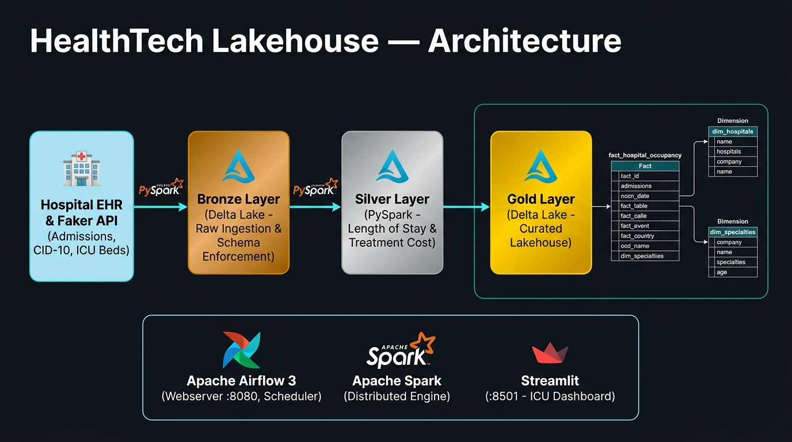
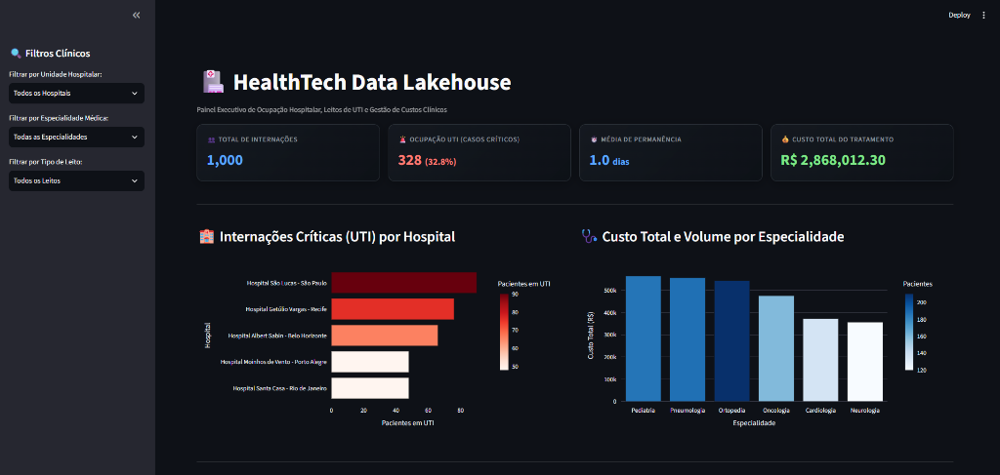
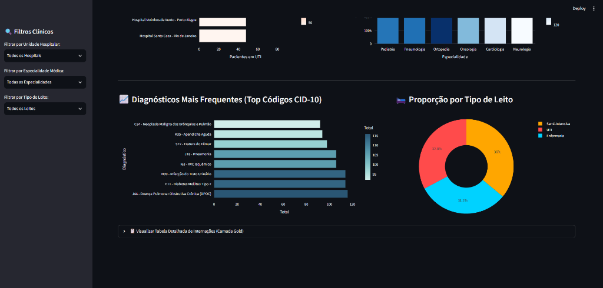
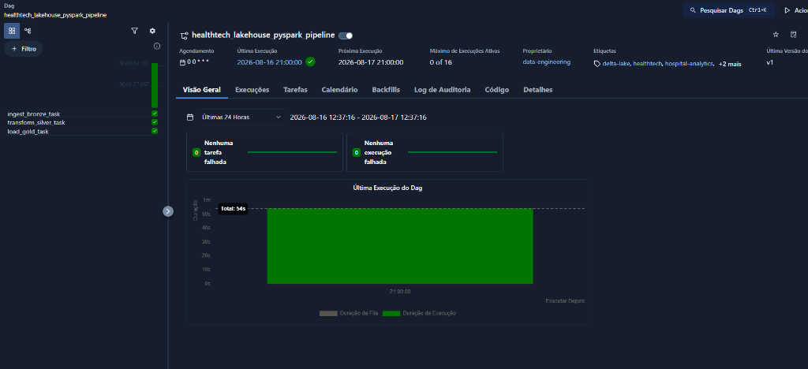

# 🏥 HealthTech Data Lakehouse — Hospital Analytics, PySpark & Delta Lake


*(Bilingual Documentation: [Português](#-português) | [English](#-english))*

---

## 🏗️ Architecture Blueprint / Diagrama de Arquitetura

<p align="center">
  
</p>

---

## 🇧🇷 Português

Este projeto implementa uma plataforma completa de **Data Lakehouse para Gestão Hospitalar & Cuidados Críticos (UTI)** sob a **Arquitetura Medalhão** (Bronze ➔ Silver ➔ Gold). A solução integra processamento distribuído massivo em **PySpark**, armazenamento colunar ACID resiliente em **Delta Lake**, modelagem dimensional **Star Schema (Kimball)**, orquestração automatizada no **Apache Airflow 3**, validação por suíte de testes em **Pytest** e um painel executivo interativo em **Streamlit & Plotly**.

---

### 📊 Painel Executivo de Gestão Hospitalar (Streamlit Analytics)

<p align="center">
  
</p>

<p align="center">
  
</p>

- **KPIs em Tempo Real:** Total de internações (1.000 pacientes), taxa de ocupação de leitos de UTI (32.8% com alerta de saturação > 30%), tempo médio de permanência e custo total acumulado (R$ 2.868.012,30).
- **Análises Clínicas:** Ranking de hospitais com maior demanda crítica (Hospital São Lucas SP no topo), distribuição de custos por especialidade médica (Pediatria e Pneumologia), patologias mais frequentes (Top CIDs) e proporção por tipo de leito (Donut Chart).

---

### ⚡ Orquestração no Apache Airflow 3

<p align="center">
  
</p>

- **DAG:** `healthtech_lakehouse_pyspark_pipeline` (Execução completa em 54 segundos com 100% de sucesso).
- **Padrão Lazy Imports:** Importação sob demanda das dependências da JVM para isolar tarefas e prevenir sobrecarga no Scheduler do Airflow.

---

### 💡 Decisões Técnicas de Engenharia

| Decisão de Arquitetura | Justificativa Técnica |
| :--- | :--- |
| **Delta Lake (Transações ACID)** | Garante atomicidade em gravações distribuídas. Se uma tarefa falhar no meio, o commit não é registrado no `_delta_log` (Rollback automático). |
| **Schema Enforcement (`StructType`)** | Contrato de dados estrito na ingestão Bronze. Bloqueia corrupção caso o sistema hospitalar envie formatos inválidos. |
| **Particionamento Inteligente (*Partition Pruning*)** | A Bronze e Silver são particionadas por `hospital_id` (baixa cardinalidade), enquanto a Tabela Fato na Gold é particionada por `year_month` para acelerar relatórios temporais em até 90%. |
| **Modelagem Star Schema (Kimball)** | Separação estrita entre métricas numéricas agregáveis (`fact_hospital_occupancy` no centro) e tabelas de contexto descritivo (`dim_hospitals`, `dim_specialties` ao redor). |
| **Lazy Imports no Airflow 3** | Mover as importações de PySpark para dentro dos callables das tarefas evita que o Scheduler inicialize a JVM em cada ciclo de parsing (a cada 30 segundos). |
| **Padrão AAA nos Testes Unitários** | Testes isolados com `pytest` utilizando pastas descartáveis (`tmp_path`) e asserções estritas com `assert` sem impactar os dados reais de produção. |

---

### 📂 Estrutura do Repositório

```text
healthtech-lakehouse/
├── .venv/                         # Ambiente Virtual Local
├── README.md                      # Documentação completa do projeto
├── requirements.txt               # Dependências do projeto
├── main.py                        # Ponto de entrada para execução e validação local
├── app.py                         # Painel Executivo Interativo (Streamlit & Plotly)
│
├── dags/
│   └── healthtech_lakehouse_dag.py # DAG de orquestração no Apache Airflow 3
│
├── src/
│   ├── __init__.py                # Pacote Python
│   ├── bronze.py                  # Ingestão Bronze com Schema Enforcement
│   ├── silver.py                  # Limpeza, deduplicação e Feature Engineering
│   └── gold.py                    # Modelagem dimensional Star Schema (Fato & Dimensões)
│
├── tests/
│   └── test_silver.py             # Suíte de testes unitários automatizados (Pytest)
│
├── docs/
│   ├── architecture_blueprint.png # Diagrama oficial de arquitetura End-to-End
│   ├── airflow_execution.png      # Evidência de execução 100% verde no Airflow
│   ├── streamlit_dashboard_1.png  # Evidência do Dashboard (KPIs e Rankings)
│   └── streamlit_dashboard_2.png  # Evidência do Dashboard (CIDs e Leitos)
│
└── storage/                       # Data Lakehouse Local (Delta Lake Tables)
    ├── bronze/                    # Dados brutos particionados por hospital_id
    ├── silver/                    # Dados curados particionados por hospital_id
    └── gold/                      # Tabela Fato (year_month) e Dimensões
```

---

### 🚀 Como Executar o Projeto

#### 1. Clonar o repositório e preparar o ambiente
```bash
git clone https://github.com/loweri/healthtech-lakehouse.git
cd healthtech-lakehouse

python3 -m venv .venv
source .venv/bin/activate
pip install -r requirements.txt
```

#### 2. Executar o Pipeline Localmente
```bash
python3 main.py
```

#### 3. Executar os Testes Unitários
```bash
python3 -m pytest tests/test_silver.py -v
```

#### 4. Iniciar o Painel Streamlit
```bash
streamlit run app.py
```
Acesse `http://localhost:8501` no navegador.

#### 5. Executar no Apache Airflow 3
```bash
cp dags/healthtech_lakehouse_dag.py ~/airflow/dags/
airflow standalone
```
Acesse `http://localhost:8080`, ative a DAG `healthtech_lakehouse_pyspark_pipeline` e clique em **Trigger DAG** ▶️.

---

## 🇺🇸 English

Enterprise-grade **HealthTech Data Lakehouse** built upon the **Medallion Architecture** (Bronze ➔ Silver ➔ Gold). The platform couples distributed processing via **Apache Spark (PySpark)** with ACID guarantees and Time Travel features of **Delta Lake**, fully orchestrated by **Apache Airflow 3**, validated through **Pytest** automated testing, and visualized via an interactive **Streamlit & Plotly** executive dashboard.

### 🌟 Key Highlights

- **Architecture Blueprint:** End-to-end data pipeline connecting hospital EHR data sources, Bronze ingestion, Silver PySpark feature engineering, Gold Kimball Star Schema, Airflow orchestration, and Streamlit consumption.
- **Distributed Data Engine:** PySpark for processing large-scale hospital admission records without memory bottlenecks.
- **ACID Transaction Log:** Delta Lake table format enabling reliable writes, schema enforcement, and time travel capabilities.
- **Dimensional Modeling (Star Schema):** Curated Fact Table (`fact_hospital_occupancy`) partitioned by `year_month` coupled with dimension tables (`dim_hospitals`, `dim_specialties`).
- **Airflow 3 Orchestration:** DAG utilizing Lazy Imports for lightweight scheduler parsing cycles and robust task dependency management.
- **Automated Unit Testing:** Pytest suite with isolated Spark fixtures validating length of stay calculations, ICU flags, and cost metrics.
- **Executive Analytics:** Streamlit dark-mode dashboard with dynamic hospital filters, ICU capacity alerts, and diagnostic distributions.

---

## 👨‍💻 Autor / Author

**Ericles Fernandes Oliveira** — *Data Engineer*  
GitHub: [loweri](https://github.com/loweri) | LinkedIn: [ericlesoliveira](https://www.linkedin.com/in/ericlesoliveira/)
